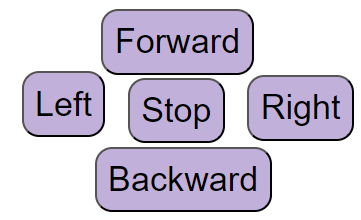
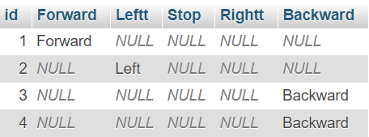

# Remote Control 

There is two pages, the first page contain a remote control with 5 buttons (Forward, Left, Stop, Right and Backward) when one of these buttons is pressed, the name of the pressed button will be stored in the database (SQL database).
Then the second page shows the name of the pressed button.

## index.html 

This is the html page that contain the remote control

## Database

SQL database Created in phpMyAdmin
it has 6 columns (id(the primary key with auto increasment),Forward, Leftt, Stop, Rightt and Backward)

## t.php

The php code for connecting and storing the data to the database

## result.php

The php code that shows the name of the pressed button.

